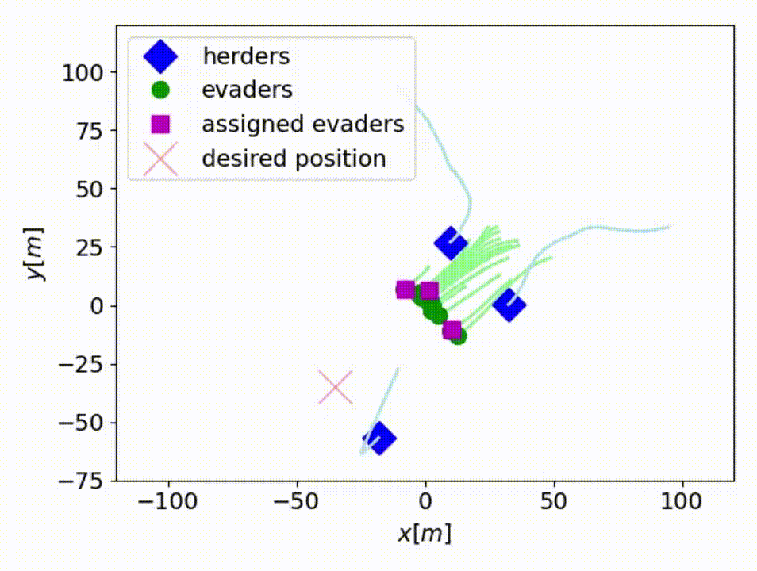

# Multi-robot Implicit Control of Herds

This repository provides a variety of codes that implement our novel "Implicit Control" technique applied to the multi-robot herding problem. In summary, we have developed a new control strategy, Implicit Control, able to efficiently herd hetereogeneous groups of noncooperative evaders, such as sheeps. The intuition behind this methodology consists in driving the input, rather than computing it, toward the unknown value that achieves the desired dynamic behavior of the herd. Thanks to Implicit Control, we are capable of steering groups of heterogeneous herds to desired individually assigned positions simultaneously, drive them towards dynamic references, gather and herd large groups of evaders with just a few robots, or adapt to partially unknown evaders' dynamics.

We hope you like it!

More info at: https://sites.google.com/unizar.es/poc-team/research/mrherding

Video: https://www.youtube.com/watch?v=U5KjP-2H1BM

Arxiv: https://arxiv.org/abs/2206.05888

## Dependencies

Our code is tested with Python 3.9.12. It depends on the following Python packages: 

```numpy 1.22.3```

```matplotlib 3.3.4```

```scipy 1.7.3```

## Demo with Adaptive Heterogeneous Herds
Run the different files in ```codes/AdaptiveHerding/``` to check the performance of Implicit Control in the herding of heterogeneous groups of herds, adapting to the partially unknown dynamics of the evaders to ensure the stability of the system. The file ```functions.py``` includes all the functions that implement the control strategies. The other files adopt the name of the corresponding figure in the paper [Adapative Multirobot Implicit Control of Heterogeneous Herds](https://arxiv.org/abs/2206.05888).

&nbsp; &nbsp; &nbsp; &nbsp; &nbsp; &nbsp; &nbsp; &nbsp; &nbsp; &nbsp; &nbsp; &nbsp; &nbsp; &nbsp; &nbsp; ``` Simulations ``` &nbsp; &nbsp; &nbsp; &nbsp; &nbsp; &nbsp; &nbsp; &nbsp; &nbsp; &nbsp; &nbsp; &nbsp; &nbsp; &nbsp; &nbsp; &nbsp; &nbsp; &nbsp; &nbsp; &nbsp; &nbsp; &nbsp; &nbsp; &nbsp; &nbsp; &nbsp; &nbsp; &nbsp; &nbsp;  ``` Experiments ``` 

<p float="left">
&nbsp; &nbsp;  &nbsp; &nbsp; &nbsp; &nbsp; &nbsp; &nbsp; &nbsp; &nbsp; &nbsp; &nbsp; &nbsp; &nbsp; &nbsp;

</p>

## Demo with Massive Herds
Run ```codes/MassiveHerds/simulations.py``` to check the performance of Implicit Control in the herding of large groups of herds by means of a few robotic herders. The control strategy includes a dynamic assignment module that selects the evaders that are worth to directly control. More details available at our paper on [Multi-robot Implicit Control of Massive Herds](https://arxiv.org/pdf/2209.09705.pdf). The file ```functions.py``` includes all the functions that implement the control strategy.

&nbsp; &nbsp; &nbsp; &nbsp; &nbsp; ``` 50 inverse evaders vs 4 herders ``` &nbsp; &nbsp; &nbsp; &nbsp; &nbsp; &nbsp; &nbsp; &nbsp; &nbsp; &nbsp; &nbsp; &nbsp; &nbsp; &nbsp; &nbsp; ``` 20 exponential evaders vs 3 herders ``` 

<p float="left">
&nbsp; &nbsp; &nbsp; &nbsp; &nbsp; &nbsp;  &nbsp; &nbsp; &nbsp; &nbsp; &nbsp; &nbsp; &nbsp; &nbsp;

</p>

## Citation
If you find our papers/code useful for your research, please cite our work as follows.

E. Sebastian, E. Montijano, C. Sagues. [Adapative Multirobot Implicit Control of Heterogeneous Herds](https://arxiv.org/abs/2206.05888), IEEE Transactions on Robotics, vol. 38, no. 6, pp. 3622-3635, Dec. 2022 

 ```bibtex
@ARTICLE{sebastian22herding,
  author={Sebastián, Eduardo and Montijano, Eduardo and Sagüés, Carlos},
  journal={IEEE Transactions on Robotics}, 
  title={Adaptive Multirobot Implicit Control of Heterogeneous Herds}, 
  year={2022},
  volume={38},
  number={6},
  pages={3622-3635},
  doi={10.1109/TRO.2022.3183537}}
```
